# 🌍 Travel.Web

**ASP.NET Core MVC** ve **MongoDB** kullanılarak geliştirilmiş tur, rezervasyon ve içerik yönetim uygulaması.

Projenin temel amacı MongoDB'yi yalnızca CRUD seviyesinde değil; **veri modelleme, indexleme, arama, aggregation ve sorgu performansı** gibi konularla birlikte gerçek bir proje üzerinde uygulamaktır.

---

## 🚀 Özellikler

### Kullanıcı Tarafı

- Tur listeleme ve detay görüntüleme
- Şehir, ülke ve fiyat bazlı filtreleme
- MongoDB Text Search ile genel arama
- Sayfalama ve sıralama
- Tur değerlendirme ve yorum sistemi
- Rezervasyon oluşturma
- Rezervasyon kodu ve e-mail ile rezervasyon sorgulama

### Admin Paneli

- Tur yönetimi
- Banner yönetimi
- Yorum yönetimi
- Rezervasyon ve durum yönetimi
- Aylık rezervasyon takvimi
- Tarih bazlı katılımcı görüntüleme

---

# 🖥️ Uygulama Görselleri

## Kullanıcı Tarafı

### Tur Keşfet

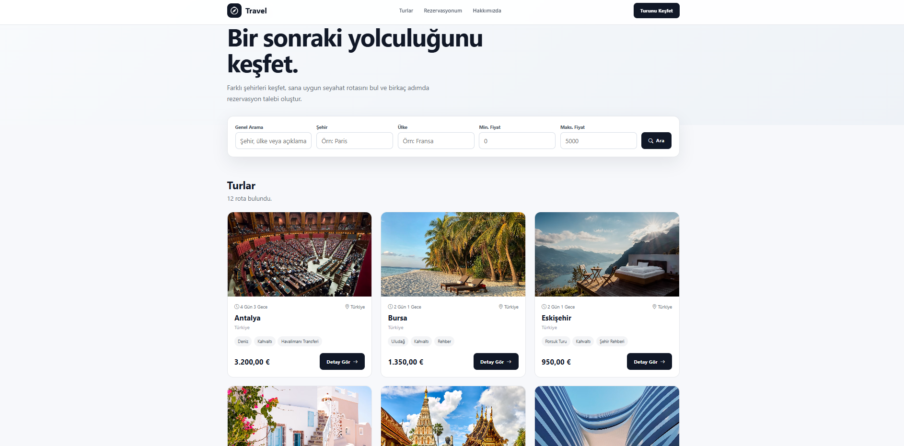

### Tur Detayı

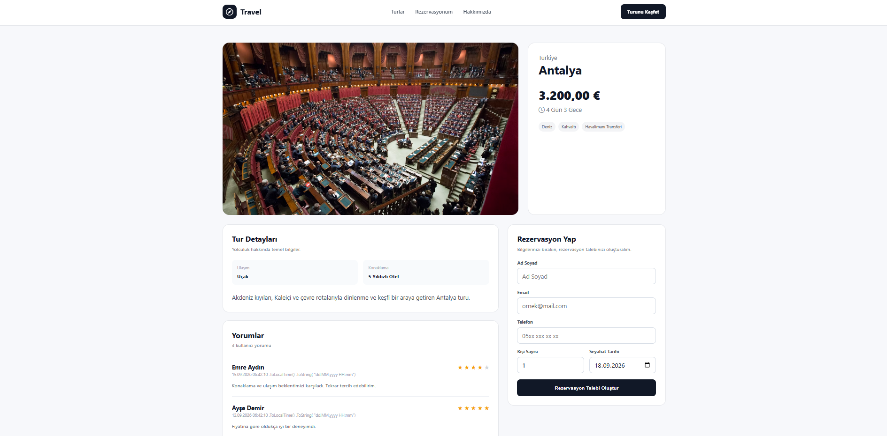

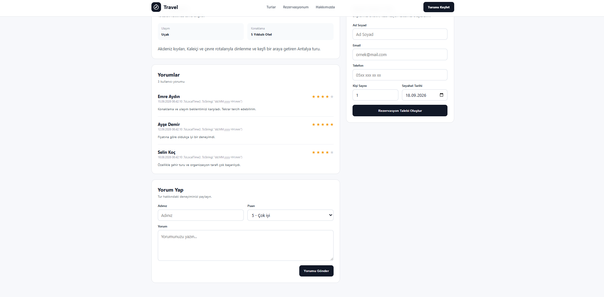

### Rezervasyon Sorgulama

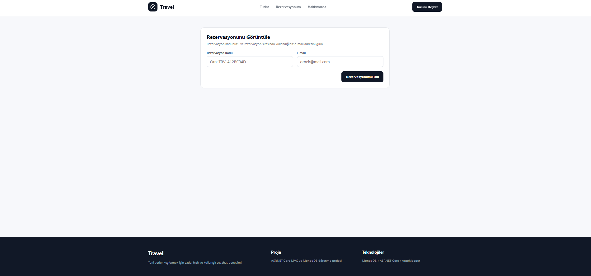

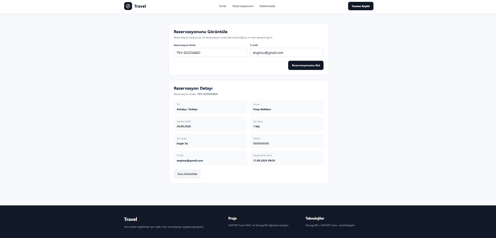

---

## Admin Paneli

### Rezervasyon Yönetimi

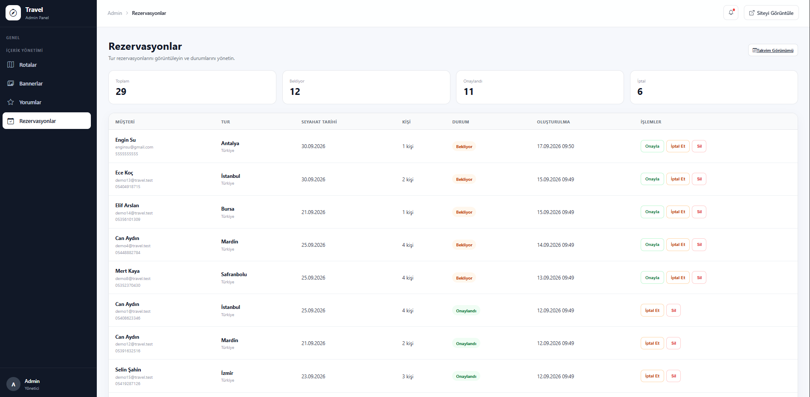

### Rezervasyon Takvimi

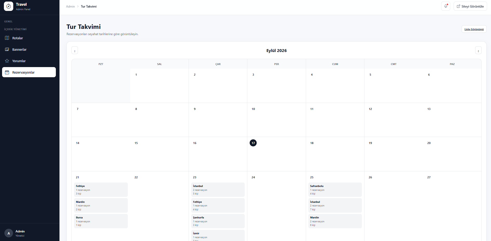

### Günlük Katılımcılar

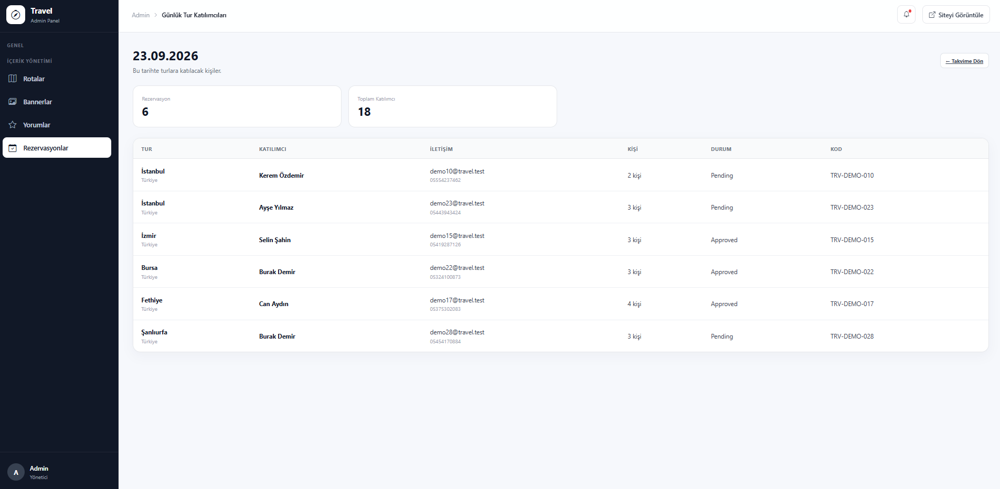

### Rota Yönetimi

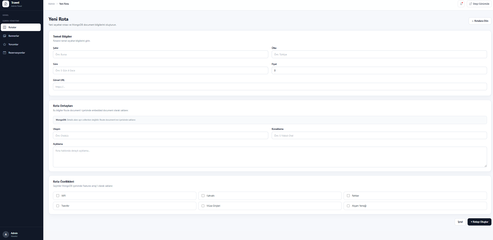

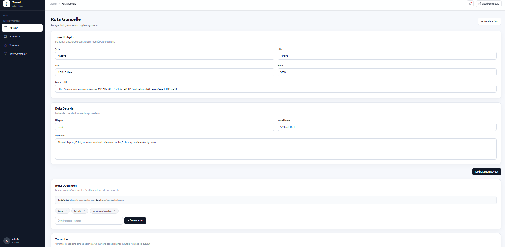

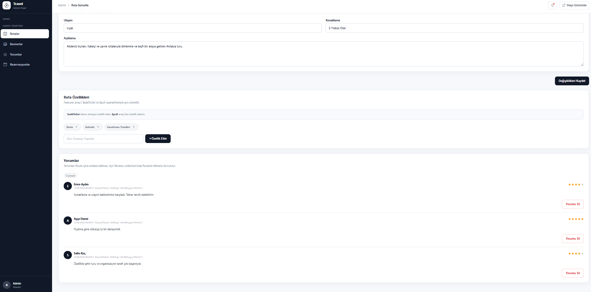

### Yorum Yönetimi

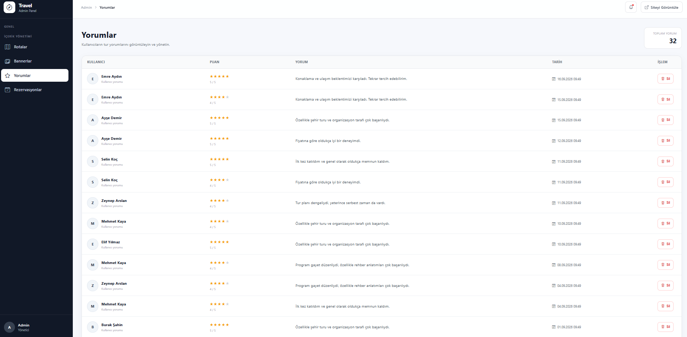

---

## 🛠️ Teknolojiler

- ASP.NET Core MVC
- C#
- MongoDB
- MongoDB.Driver
- AutoMapper
- FluentValidation
- Razor
- HTML / CSS

---

## 🍃 MongoDB Kullanımı

Projede MongoDB'nin temel ve ileri seviye özellikleri uygulamalı olarak kullanılmıştır:

- CRUD işlemleri
- Embedded Document ve Array yapıları
- Collection'lar arası Reference kullanımı
- `$set`, `$addToSet`, `$pull`
- `$eq`, `$gte`, `$lte`, `$ne` filtreleri
- Regex ve Text Search
- `Skip / Limit` ile pagination
- Single, Compound, Unique ve Text Index
- Aggregation Pipeline
- `$match`, `$group`, `$sum`, `$lookup`, `$unwind`, `$project`
- Explain Plan ile sorgu analizi
- `IXSCAN` ve `COLLSCAN` karşılaştırması

---

## 🗂️ Veri Modeli

```text
Route
├── Details (Embedded Document)
├── Features[] (Array)
│
├── Reviews
│   └── RouteId
│
└── Reservations
    └── RouteId
```

`Route` detayları ve özellikleri document içerisinde tutulurken, **Review** ve **Reservation** kendi collection'larında `RouteId` üzerinden ilişkilendirilmiştir.

---

## ⚡ Index Stratejisi

```text
Routes
├── City
├── Country
├── Price
├── Country + City + Price
└── Text Search

Reviews
└── RouteId + CreatedDate

Reservations
├── RouteId
├── CreatedDate
└── ReservationCode (Unique)
```

MongoDB Explain Plan kullanılarak indexli ve indexsiz sorguların `IXSCAN` / `COLLSCAN` davranışları incelenmiştir.

---

## 📊 Aggregation Pipeline

Admin rezervasyon takvimi MongoDB **Aggregation Pipeline** ile oluşturulmaktadır.

```text
$match
   ↓
$group
   ↓
$lookup → Routes
   ↓
$unwind
   ↓
$project
   ↓
$sort
```

Bu yapı sayesinde tarih ve tur bazında rezervasyon sayısı ve toplam katılımcı sayısı MongoDB tarafında hesaplanmaktadır.

---

## 📁 Proje Yapısı

```text
Travel.WEB
├── Areas/Admin
├── Controllers
├── DTOs
├── Entities
├── Mappings
├── Models
├── Seeders
├── Services
├── Settings
├── Validations
├── Views
└── wwwroot
```

---

## ▶️ Çalıştırma

MongoDB bağlantısını `appsettings.json` içerisinde yapılandırın:

```json
{
  "DatabaseSettings": {
    "ConnectionString": "mongodb://localhost:27017",
    "DatabaseName": "TravelDb",
    "BannerCollectionName": "Banners",
    "RouteCollectionName": "Routes",
    "ReviewCollectionName": "Reviews",
    "ReservationCollectionName": "Reservations"
  }
}
```

Ardından:

```bash
dotnet restore
dotnet run
```

> Gerçek kullanıcı adı, parola veya production connection string bilgilerini repository içerisinde tutmayın.

---

## 🎯 Proje Amacı

Bu proje, **ASP.NET Core ile MongoDB entegrasyonunu ve MongoDB'nin gerçek uygulamalardaki kullanım senaryolarını** deneyimlemek amacıyla geliştirilmiştir.
